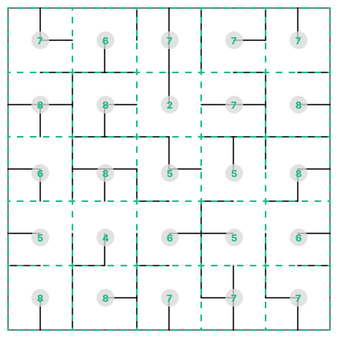

# Magellan - JDIS Games 2024

## Introduction

Imagine yourself at the beginning of the 16th century 📜, a time when maps of the world were still filled with unknown and mysterious zones 🗺️. Amidst this era of discoveries and explorations, Ferdinand Magellan, a Portuguese explorer, was preparing for his journey. His goal: to find a sea route to the spice islands 🌿, whose riches were coveted by all of Europe 💰.

Aboard his ship 🚢, Magellan and his crew ventured into uncharted waters 🌊, armed with patience and their navigational knowledge 🧭. Their main ally was the astrolabe, an instrument capable of measuring the altitude of stars and planets ✨. This tool was indispensable for charting their course across the vast oceans, allowing them to carve a path into the unknown 🚀.

## Your Objective

Like Magellan, you will become explorers navigating unknown waters in search of treasure. You know its coordinates 📍, but the location of obstacles remains unclear 🌫️. Your adventure will have two phases: discovery 🔍 and acquisition 🗝️.

In the game Magellan, you control an agent that can move across a map. You must navigate the map to collect coins 🪙 and treasures 💰 along your path while defending against other agents ⚔️.

## Game Progression

The game operates in a "Long running" format ⏳, which means it never stops. Multiple games will take place throughout the day 🌞. You will accumulate points **throughout the day** 📊. You need to plan the best times to disconnect your agent to upload a new version. It is recommended to design your bot incrementally and continuously improve it 🚀.

A refresh cycle (tick) lasts 300 ms ⏱️. During a refresh cycle, the server will perform 10 action loops.

During previous expeditions, some information was gathered 📚. Therefore, in a game, the agent will be placed on one of the maps 🗺️ and will receive information about the [elements]() present, although the exact location of walls was not recorded 🧱. Subsequently, the agent can send multiple [actions]() per refresh cycle.

In each new game, all walls, agents and coins are randomly placed on the map 🎲. A game consists of two phases:
- [Phase 1: Discovery]() 🔍
- [Phase 2: Acquisition]() 🗝️

## Map Elements

The following elements will be found on the map:

|        |                                             |                                                                                                                                  |
| ------ | ------------------------------------------- | :------------------------------------------------------------------------------------------------------------------------------- |
| Coin   |                    | Placed randomly in the first phase of the game, gives 40 points when collected.                                                  |
| Treasure|              | Placed randomly in the second phase of the game, gives 1200 points when collected. Only one treasure is present on the map.      |
| Wall   |                                             | Walls are not visible on the map to the agents.                                                                                  |

### Phase 1

During the first phase of the game, the agents connected to the server and the coins will be randomly placed on the map. 🗺️ This is the phase of discovery and exploration.

When an agent collects a coin, it will reappear randomly on the map.

At the end of the phase, the agents and the coins are removed from the map to transition to the second phase.

### Phase 2

During the final phase of the game, a treasure will be placed on the map 🗺️, and the agents will appear equidistant from the treasure. In this phase, there will be no coins on the map.

### Death

An agent can deal damage to other agents using the cannon and the blade. When the agent loses all its health 💀, it disappears from the map and does not receive any data from the server for a defined period ⏳.

## Actions

Multiple actions can be sent to the server within the same refresh cycle with certain usage constraints.

### Movement

The position sent is the one to which the agent will move 🧭. The agent cannot pass through walls 🧱. To reach a specific position, you will need to implement a pathfinding algorithm.

This action has no usage constraints.

### Attack

Agents can attack during both phases of the game.

- **Weapon Change** ⚔️
    Each weapon allows you to perform a different action. To use a weapon, you must equip it using the weapon change action.
    Switching weapons will then allow the agent to either use the cannon to shoot at a target or to adjust the blade's rotation angle.

    This action cannot be accompanied by the use of a weapon in the same refresh cycle.

- **Canon** 🔫
    To use the cannon, you need to send the desired destination position for a projectile. The projectile has a defined range. When a projectile collides with another agent, that agent takes 15 damage points. The projectile then disappears. 

    This action cannot be accompanied by the equipping of a weapon in the same refresh cycle.

- **Blade** 🗡️
    At the beginning of the game, the blade will appear at 0 radians from the player as illustrated in the following image.

    <div align="center">
    
    </div>

    To change the rotation of the blade, you need to send the new rotation in radians. When the blade collides with an agent, the agent receives a maximum of 40 damage points. The number of damage points depends on the duration the blade is in contact with the agent during a refresh cycle.

    This action cannot be accompanied by the equipping of a weapon in the same refresh cycle.

### Save

A limited amount of bytes can be sent to the server 💾. These bytes will be saved for the duration of a game. These data will be received by the player each time they connect to the server. This action allows you to save information that you can access in the same game when your bot is disconnected.

## Received Data

### Map State

The agent receives the state of the map when it connects to the server 🗺️.

```
MapState {
DiscreteGrid: [][]Integer,    // Grid containing the number of walls per 4 cells
size: int,                    // The size of the map
walls: List[Collider],        // The list of walls, this list should be empty
save: bytearray               // The memory you can save in the game
}
```

### Discrete Grid

The map is received as a discrete grid. The discrete grid contains only the number of walls per 4 cells. The outer walls delimiting the map are also counted. The grid is sent at the beginning of each game in the map state. The grid does not change during a game, but a new map is generated at the beginning of each game. The walls of a grid are placed randomly at the beginning of each new game 🎲.

Here is a representation of a discrete grid that can be received for a given map:

<div align="center">
  
</div>

In the example grid, the large cells measure 10 by 10 units. The entire grid of the map measures 10 by 10 cells. It is worth noting that an agent measures 1 by 1 unit.

### Scoring

You will accumulate points throughout the day using these items:

| Item       | Points |
| ---------- | ------ |
| Cannon     | 15     |
| Blade      | 40     |
| Coin       | 40     |
| Treasure   | 1200   |

### Game State

The agent receives the game state at each refresh cycle.

```
GameState {
    currentTick : Integer,                          // Current refresh cycle
    currentRound : Integer,                         // Current round
    Players : [                                     // List of player information
        name : String,                              // Player's name
        color : String,                             // Player's color on the map
        health : Integer,                           // Player's health
        score : Integer,                            // Player's score
        position : { x : Float, y : Float },        // Current position
        destination : { x : Float, y : Float },     // Destination position
        playerWeapon : Integer,                     // Type of equipped weapon, none(0), cannon(1), sword(2)
        Projectiles: [                              // Cannon projectile information
            uid : String,                           // Projectile ID
            position : { x : Float, y : Float },    // Current position
            destination : { x : Float, y : Float }, // Destination position
        ],
        Blade: {                                    // Sword information
            start : { x : Float, y : Float },       // Sword start position
            end : { x : Float, y : Float },         // Sword end position
            rotation : Integer                      // Rotation angle in radians
        }
    ],
    Coins : [                                       // List of coins or treasure
        uid : String,                               // Coin ID
        value : Integer,                            // Coin or treasure value
        position : { x : Float, y : Float }         // Coin or treasure position
    ]
}
```

## Constants

| **Map Constants**                                    |        |
| :--------------------------------------------------- | :----: |
| Width of the map in number of cells                  | 10     |
| Height of the map in number of cells                 | 10     |
| Width of each cell                                   | 10.0   |
| Height of each cell                                  | 10.0   |

| **Agent Constants**                                  |        |
| :--------------------------------------------------- | :----: |
| Size of a bot                                        | 1.0    |
| Player speed (per second)                            | 1.15   |
| Maximum health                                       | 100    |
| Time to respawn after death (seconds)                | 5.0    |

| **Projectile Constants**                             |        |
| :--------------------------------------------------- | :----: |
| Projectile size                                      | 0.35   |
| Projectile speed (per second)                        | 3.0    |
| Damage inflicted by projectile                       | 30     |
| Projectile lifespan (seconds)                        | 5.0    |
| Points                                               | 15     |

| **Blade Constants**                                  |        |
| :--------------------------------------------------- | :----: |
| Blade length (from the center of an agent)           | 2.0    |
| Blade thickness                                      | 0.25   |
| Damage inflicted by blade                            | 4 - 40 |
| Points                                               | 4 - 40 |

| **Coin Constants**                                   |        |
| :--------------------------------------------------- | :----: |
| Coin size                                            | 0.5    |
| Quantity                                             | 30     |
| Points                                               | 40     |

| **Treasure Constants**                               |        |
| :--------------------------------------------------- | :----: |
| Treasure size                                        | 4.0    |
| Points                                               | 1200   |


## Interaction with the Platform

### 🤝 How to Register?
1. 🌐 Go to the page [http://jdis-ia.dinf.fsci.usherbrooke.ca/rank](http://jdis-ia.dinf.fsci.usherbrooke.ca/rank)
2. 🖱️ Click the button at the top right to access the registration form.
3. 📝 In the form, enter your Bot's name (3 to 16 characters).
4. 🎯 Once the bot name is entered, click the button to register.
5. 🚀 Once registered, you should receive an authentication token at the bottom right of the page.
6. ⚠️ Make sure to note the authentication token, you will need it to connect your agent.
7. ❓ If you forgot to note it down, contact the organizers, they will help you.
8. 🔑 Each team name must be unique.

That's it! You are ready to participate! 🎉
