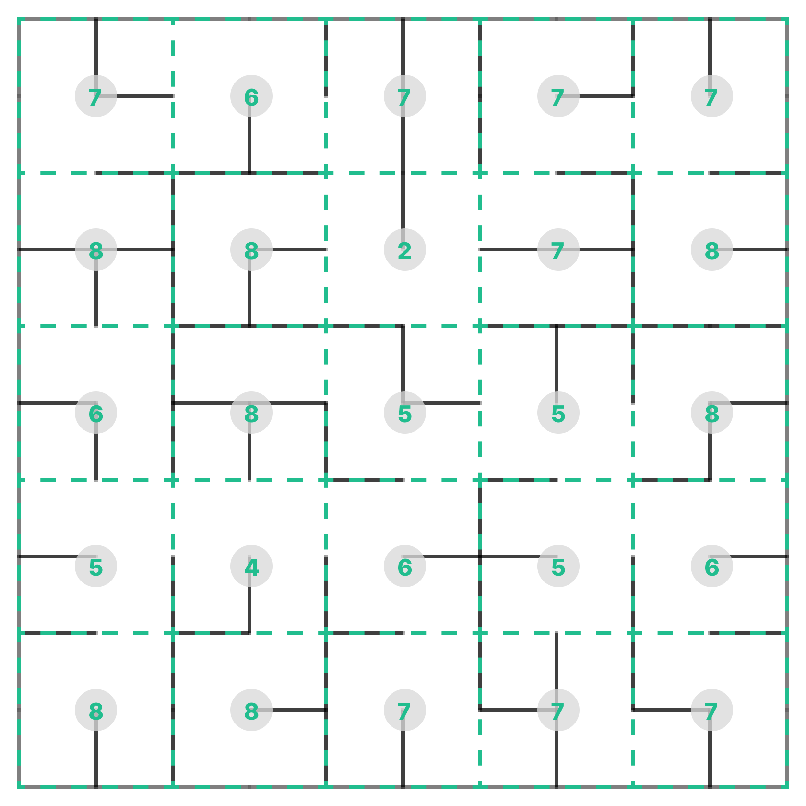

# Magellan - JDIS Games 2024

## Mise en situation

Imaginez-vous au début du 16e siècle 📜, une époque où les cartes du monde étaient encore remplies de zones inconnues et mystérieuses 🗺️. Au milieu de cette période de découvertes et d'explorations, Ferdinand Magellan, un explorateur portugais, se préparait. Son objectif : trouver une route maritime vers les îles aux épices 🌿 dont les richesses étaient convoitées par toute l'Europe 💰.

À bord de son navire 🚢, Magellan et son équipage s'aventurèrent dans des eaux inexplorées 🌊, armés de patience et de leurs connaissances en navigation 🧭. Leur principal allié était l'astrolabe, un instrument capable de mesurer l'altitude des étoiles et des planètes ✨. Cet outil était indispensable pour tracer leur chemin à travers les vastes océans, leur permettant de se frayer un chemin vers l'inconnu 🚀.

## Votre objectif

À l'image de Magellan, vous deviendrez des explorateurs naviguant sur des eaux inconnues à la recherche d'un trésor. Vous connaissez sa coordonnée 📍, mais l'emplacement des obstacles reste flou 🌫️. Il y aura deux phases dans votre aventure : découverte 🔍 et prise 🗝️.

Dans le jeu Magellan, vous contrôlez un agent pouvant se déplacer sur une carte. Vous devrez vous déplacer sur la carte afin de ramasser les pièces 🪙 et les trésors 💰 se trouvant sur votre chemin tout en vous défendant contre les autres agents ⚔️.

## Déroulement du jeu

Le jeu est sous format _"Long running"_ ⏳, ce qui signifie qu'il ne s'arrête jamais. Plusieurs parties auront lieu au cours de toute la journée 🌞. Vous accumulerez des points **tout au long de la journée** 📊. Vous devez prévoir les meilleurs moments pour déconnecter votre agent afin d'y mettre une nouvelle version. Il est conseillé de concevoir son bot de manière incrémentale et de faire de l’amélioration continue 🚀.

Un cycle de rafraîchissement (tick) dure 300 ms ⏱️. Durant un cycle de rafraîchissement, le serveur effectuera 10 boucles d'action.

Lors des précédentes expéditions, certaines informations ont été recueillies 📚. Par conséquent, lors d'une partie, l'agent sera placé sur une des carte 🗺️ et recevra des informations sur les [éléments](#éléments-de-la-carte) s'y trouvant, bien que l'emplacement exact des murs n'ait pas été recueilli 🧱. Par la suite, l'agent pourra envoyer plusieurs [actions](#actions) par cycle de rafraîchissement.

À chaque nouvelle partie, tous les murs, les agents et les pièces sont placés de manière aléatoire sur la carte 🎲. Une partie est composée de deux phases :
- [Phase 1 : Découverte](#phase-1) 🔍
- [Phase 2 : Prise](#phase-2) 🗝️

## Éléments de la carte

Les éléments suivants se trouveront sur la carte :   

|        |                                             |                                                                                                                                  |
| ------ | ------------------------------------------- | :------------------------------------------------------------------------------------------------------------------------------- |
| Pièce  |       | Placés aléatoirement dans la première phase du jeu, donne 40 points lorsque ramassé.                                             |
| Trésor |  | Placé aléatoirement à la deuxième phase du jeu, donne 1200 points lorsque ramassé. Seulement un trésor est présent sur la carte. |
| Mur    |                                             |  Les murs ne sont pas visibles sur la carte par les agents.                                                                      |

### Phase 1

Lors de la première phase de la partie, les agents connectés au serveur ainsi que les pièces seront placés de manière aléatoire sur la carte 🗺️. Ceci est la phase de découverte et d'exploration.

Lorsqu'un agent prend une pièce, celle-ci réapparaît de manière aléatoire sur la carte.

À la fin de cette phase, les agents et les pièces sont enlevés de la carte pour passer à la deuxième phase.

### Phase 2

Lors de la dernière phase de la partie, un trésor sera placé sur la carte 🗺️, et les agents apparaîtront à équidistance de déplacement du trésor. Dans cette phase, il n'y aura pas de pièces sur la carte.

### Mort

Un agent pourra infliger des dégâts aux autres agents à l'aide du canon et de la lame. Lorsqu'un agent perd toute sa vie 💀, il disparaît de la carte et ne reçoit aucune donnée du serveur pendant un temps défini ⏳.

## Actions

Plusieurs actions peuvent être envoyées au serveur dans un même cycle de rafraîchissement, mais il y a certaines contraintes d'utilisation.

### Déplacement

La position envoyée est celle vers laquelle l'agent va se déplacer 🧭. L'agent ne peut pas traverser les murs 🧱. Pour vous rendre à une position précise, vous devrez implémenter un algorithme de recherche de chemin (pathfinding).

Cette action n'a pas de contraintes d'utilisation.

###  Attaque

Les agents pourront attaquer durant les deux phases du jeu.

- **Changement d'arme** ⚔️
    Chaque arme vous permet d'effectuer une action différente. Pour pouvoir utiliser une arme, vous devez d'abord vous équiper de celle-ci à l'aide du changement d'arme.

    Le changement d'arme permettra à l'agent d'utiliser ensuite le canon pour tirer sur une destination ou de changer l'angle de rotation de la lame.

    Cette action ne peut pas être accompagnée de l'utilisation d'une arme dans un même cycle de rafraîchissement.

- **Canon** 🔫
    Pour utiliser le canon, il faut envoyer la position de destination souhaitée pour un projectile. Le projectile a une portée définie. Lorsqu'un projectile entre en collision avec un autre agent, ce dernier reçoit 15 points de dégâts. Le projectile disparaît ensuite.

    Cette action ne peut pas être accompagnée de l'équipement d'une arme dans le même cycle de rafraîchissement.

- **Lame** 🗡️ 
    En début de partie, la lame apparaîtra à 0 radians du joueur, comme illustré à l'image suivante.  

    <div align="center">
    
    </div>

    Pour changer la rotation de la lame, il faut envoyer la nouvelle rotation en radians. Lorsque la lame entre en collision avec un agent, ce dernier reçoit jusqu'à 40 points de dégâts. Le nombre de points de dégâts dépendra de la durée pendant laquelle la lame sera en contact avec l'agent durant un cycle de rafraîchissement.

    Cette action ne peut pas être accompagnée de l'équipement d'une arme dans le même cycle de rafraîchissement.

### Sauvegarde

Une quantité limitée d'octets pourra être envoyée au serveur 💾. Ces octets seront sauvegardés le temps d'une partie. Les données seront reçues par le joueur à chaque fois qu'il se connecte au serveur. Cette action vous permettra donc de sauvegarder des informations accessibles dans une même partie même lorsque votre bot sera déconnecté.

## Données reçues

### État de la carte

L'agent reçoit l'état de carte lorsqu'il se connecte au serveur 🗺️. 

```
MapState {
    DiscretGrid : [][]Integer,      // Grille contenant le nombre de murs par 4 cases
    size: int,                      // La taille de la carte
    walls: List[Collider],          // La liste des murs, cette liste devrait être vide
    save: bytearray                 // La mémoire que vous pouvez sauvegardé dans le jeu
}
```

### Grille discrète

La carte est reçue sous forme de grille discrète. Cette grille discrète indique le nombre de murs par 4 cases, y compris les murs extérieurs délimitant la carte. La grille est envoyée au début de chaque partie dans l'état de la carte. Elle ne change pas au cours d'une partie, mais une nouvelle carte est générée à chaque début de partie. Les murs de la grille sont placés de manière aléatoire à chaque nouvelle partie 🎲.

Voici la représenttion d'une grille discrète pouvant être reçu pour une carte donnée :

<div align="center">
  
</div>

Sur la grille en exemple, les grandes cases mesurent 10 par 10 unités. La grille total de la carte mesure 10 par 10 cases. Il est à noter qu'un agent mesure 1 par 1 unité.

### Pointage

Vous acccumulerez des points tout au long de la journée à l'aide de ses items : 

| Item       | Points |
| ---------- | ------ |
| Canon      | 15     |
| Lame       | 40     |
| Pièce      | 40     |
| Trésor     | 1200   |

### État du jeu

L'agent reçoit l'état du jeu à chaque cycle de rafraichissement.

```
GameState {
    currentTick : Integer,                          // Cycle de rafraichissement courant
    currentRound : Integer,                         // Tour courant
    Players : [                                     // Liste des informations des joueurs 
        name : String,                              // Nom du joueur
        color : String,                             // Couleur du joueur sur la carte
        health : Integer,                           // Quantité de vie du joueur
        score : Integer,                            // Nombre de points du joueur
        position : { x : Float, y : Float },        // Position actuelle
        destination : { x : Float, y : Float },     // Position de destination
        playerWeapon : Integer,                     // Type d'arme équipée, aucune(0), canon(1), épée(2) 
        Projectiles: [                              // Informations des projectiles du canon
            uid : String,                           // Identifiant du projectile
            position : { x : Float, y : Float },    // Position actuelle
            destination : { x : Float, y : Float }, // Position de destination
        ],
        Blade: {                                    // Informations sur l'épée
            start : { x : Float, y : Float },       // Position du début de l'épée
            end : { x : Float, y : Float },         // Position de fin de l'épée
            rotation : Integer                      // Angle en radians
        }
    ],
    Coins : [                                       // Liste des pièces ou trésor
        uid : String,                               // Identifiant de la pièce
        value : Integer,                            // Valeur de la pièce ou du trésor
        position : { x : Float, y : Float }         // Position de la pièce ou du trésor
    ]
}
```

## Constantes

| **Constantes de la carte**                           |        |
| :--------------------------------------------------- | :----: |
| Largeur de la carte en nombre de cellule             | 10     |
| Hauteur de la carte en nombre de cellule             | 10     |
| Largeur de chaque cellule                            | 10.0   |
| Hauteur de chaque cellule                            | 10.0   |

| **Constantes d'un agent**                            |        |
| :--------------------------------------------------- | :----: |
| Taille d'un bot                                      | 1.0    |
| Vitesse du joueur (par seconde)                      | 1.15   |
| Vie maximale                                         | 100    |
| Temps avant de réapparaître apres une mort (seconde) | 5.0    |

| **Constantes d'un projectile**                       |        |
| :--------------------------------------------------- | :----: |
| Taille du projectile                                 | 0.35   |
| Vitesse du projectile (en seconde)                   | 3.0    |
| Dégats infligés par le projectile                    | 30     |
| Durée de vie du projectile (en seconde)              | 5.0    |
| Points                                               | 15     |

| **Constantes d'une lame**                            |        |
| :--------------------------------------------------- | :----: |
| Longueur de la lame (à partir du centre d'un agent)  | 2.0    |
| Épaisseur de la lame                                 | 0.25   |
| Dégats infligés par la lame                          | 4 - 40 |
| Points                                               | 4 - 40 |

| **Constantes d'une pièce**                           |        |
| :--------------------------------------------------- | :----: |
| Taille d'une pièce                                   | 0.5    |
| Quantité                                             | 30     |
| Points                                               | 40     |

| **Constantes d'un trésor**                           |        |
| :--------------------------------------------------- | :----: |
| Taille du trésor                                     | 4.0    |
| Points                                               | 1200   |

## Interaction avec la plateforme 

### 🤝 Comment m'inscrire ?
1. 🌐 Rendez-vous sur la page [http://jdis-ia.dinf.fsci.usherbrooke.ca/rank](http://jdis-ia.dinf.fsci.usherbrooke.ca/rank)
2. 🖱️ Cliquez sur le bouton en haut à droite pour accéder au formulaire d'inscription.
3. 📝 Dans le formulaire, inscrivez le nom de votre Bot (3 à 16 caractères).
4. 🎯 Une fois le nom du bot entré, cliquez sur le bouton pour vous enregistrer.
5. 🚀 Une fois enregistré, vous devriez recevoir un jeton d'authentification au bas droit de la page.
6. ⚠️ Assurez-vous de prendre en note le jeton d'authentification, vous en aurez besoin pour connecter votre agent.
7. ❓ Si jamais vous avez oublié de le noter, allez voir les organisateurs, ils vous aideront.
8. 🔑 Chaque nom d'équipe doit être unique.

C'est tout ! Vous êtes prêt.e à participer ! 🎉